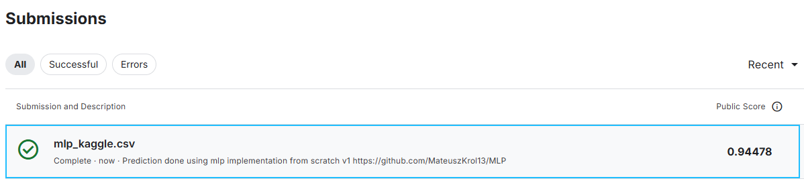

# Implementing Multi Layer Perceptron with builder pattern
 An implementation of multi layer perceptron in Python 3.9 with Numpy library as vector library. Solution also allows
 for mini-batch use, 
 
Description of objects and their jobs:
* MulitiLayerPerceptron --> implements training and inference loop and defines network structure
* Layer --> contains weights, stores gradients, implements forward pass
* Optimizer --> specifies weight updating strategy and handles gradient backward pass
* Loss --> implements loss function and handles loss / loss & output layer (softmax) derivative
* Activation (functional) --> handles data activation and activation derivative

```
├───data/
│   └───digit-recognizer - kaggle minst dataset
├───src/
│   ├───activations.py
│   ├───losses.py
│   ├───mlp.py
│   └───optimizer.py
├───tests/ - some tests to verify behaviour, not complete coverage
│   └─── ...
├───utils/
│   ├───typing - type annotations
│   │   └───__init__.py
│   ├───__init__.py - dataclass for storing gradient
│   ├───grad.py - dataclass for storing gradient
│   └───helper.py - helper functions
├───.gitignore
├───demo.py - raw-bone demo on which the solution was built
├───main.py - main program to run
├───readme.md
└───requirements.txt
```

## How to run
install dependencies (really only numpy)
```commandline
pip install -r requirements.txt
```
Then modify main.py to your liking (change weight count, add layers etc.)


```commandline
py main.py
```

## Assumptions and notation
* only sequential relations are considered (no skip connections / residuals)
* for notation simplicity numpy ~~matrix is used instead of ndarray~~ ndarrays are used.
  * element-wise multiplication a * b
  * matrix multiplication a @ b
* for simplicity, autograd is not implemented, and the layers provide recipies to optimizer on how to update values
  * for activations that rely on loss gradient to calculate their derivative, activation derivative is returned as 
None, then the optimizer passes loss gradient, which is calculated in relation to output layer activation, to lower elements

## Kaggle submission


<!--
## Toy Example: Single Training Step

To show how does a simplified neural network training looks like, I have prepared a following example, that shows
single forward pass and backwards pass, with code and explanation. Each network layer consists of an integer number of
neurons within said layer, but the weight matrix is two dimentional. This is because each neuron is directly linked to 
the input vector. That means, for example, if we have 4 neurons inside a layer that takes input of three points, the 
dimensions of weight matrix will be *3x4* (see layer 1) and bias wil have dimensions of *1x4*.

<image of network>

For simplicity this example uses *Mean Squared Error* as loss function and *Stochastic Gradient Descent* as optimizer,
but they can easily be substituted with any other loss or optimizer.


## Network layers and parameters

| ~              | Layer 1                                                                                                                | Layer 2                                                                                             | Layer 3                                                               |
|----------------|------------------------------------------------------------------------------------------------------------------------|-----------------------------------------------------------------------------------------------------|-----------------------------------------------------------------------|
| **Weights**    | $W_1 =\begin{bmatrix}[0.3 & 0.3 & 0.1 & 0.2] \\ [0.3 & 0.4 & 0.3 & 0.0] \\ [0.3 & 0.7 & 0.6 & 0.3]\end{bmatrix}_{3x4}$ | $W_2 =\begin{bmatrix} [0.5 & 0.7] \\ [0.5 & 0.6] \\ [0.8 & 0.3] \\ [0.4 & 0.7] \end{bmatrix}_{4x2}$ | $W_3 =\begin{bmatrix} [0.8 & 0.6] \\ [0.5 & 0.3 ]\end{bmatrix}_{2x2}$ |
| **Bias**       | $b_1 =[\begin{bmatrix}0.9 & 0.9 & 0.4 & 0.5\end{bmatrix}]_{1x4}$                                                       | $b_2 =[\begin{bmatrix}0.3 & 0.2\end{bmatrix}]_{1x2}$                                                | $b_3 = [\begin{bmatrix} 0.5 & 0.4 \end{bmatrix}]_{1x2}$               |
| **Activation** | ReLU                                                                                                                   | ReLU                                                                                                | Softmax                                                               |

$input = \begin{bmatrix}1. & 0.5 & -1.0 \end{bmatrix}_{1x3}$

$target = b_1 =\begin{bmatrix}0.9 & 0.9 & 0.4 & 0.5\end{bmatrix}_{2}$

---

### Forward Pass
####Layer 1

$Output_{1} = input * W_{1} + b_{1} = 
\begin{bmatrix}1. & 0.5 & -1.0 \end{bmatrix} \cdot
\begin{bmatrix}[0.3 & 0.3 & 0.1 & 0.2] \\ [0.3 & 0.4 & 0.3 & 0.0] \\ [0.3 & 0.7 & 0.6 & 0.3]\end{bmatrix} + 
\begin{bmatrix}0.9 & 0.9 & 0.4 & 0.5\end{bmatrix} = 
$

$Activation = \begin{cases} Output_{1} , & Output_{1} > 0\\ 
0, & Output_{1} \leq 0 \end{cases} = 
$

$output_{1} = \mathcal{L}_{1} (input) = ReLU() $

- Activation: **Softmax**
- Output size: **2**

---

## 2️⃣ Training Sample

**Input**
\[
x =
\begin{bmatrix}
1.0 & 0.5 & -1.0
\end{bmatrix}
\]

**Target**
\[
y =
\begin{bmatrix}
1 & 0
\end{bmatrix}
\]

**Learning rate**
\[
\eta = 0.1
\]

---

## 3️⃣ Forward Pass

### 🔹 Layer 1
\[
z_1 = x W_1 + b_1
\]

\[
z_1 =
\begin{bmatrix}
0.9 & 0.85 & 0.05 & 0.4
\end{bmatrix}
\]

Apply ReLU:
\[
a_1 = \max(0, z_1)
=
\begin{bmatrix}
0.9 & 0.85 & 0.05 & 0.4
\end{bmatrix}
\]

---

### 🔹 Layer 2
\[
z_2 = a_1 W_2 + b_2
\]

\[
z_2 =
\begin{bmatrix}
1.355 & 1.29
\end{bmatrix}
\]

Apply ReLU:
\[
a_2 =
\begin{bmatrix}
1.355 & 1.29
\end{bmatrix}
\]

---

### 🔹 Layer 3
\[
z_3 = a_2 W_3 + b_3
\]

\[
z_3 =
\begin{bmatrix}
2.249 & 1.584
\end{bmatrix}
\]

Apply Softmax:
\[
\hat{y}_i = \frac{e^{z_i}}{\sum_j e^{z_j}}
\]

\[
\hat{y} =
\begin{bmatrix}
0.66 & 0.34
\end{bmatrix}
\]

---

## 4️⃣ Loss (Mean Squared Error)

\[
\mathcal{L}
=
\frac{1}{2}
\sum_i (\hat{y}_i - y_i)^2
\]

\[
\mathcal{L}
=
\frac{1}{2}
\left[(0.66 - 1)^2 + (0.34 - 0)^2\right]
= 0.1156
\]

---

## 5️⃣ Backward Pass

### 🔹 Output Layer Delta
\[
\delta_3 = \hat{y} - y
=
\begin{bmatrix}
-0.34 & 0.34
\end{bmatrix}
\]

---

### 🔹 Gradients for Layer 3
\[
\frac{\partial \mathcal{L}}{\partial W_3}
=
a_2^\top \delta_3
=
\begin{bmatrix}
-0.461 & 0.461 \\
-0.439 & 0.439
\end{bmatrix}
\]

\[
\frac{\partial \mathcal{L}}{\partial b_3}
=
\begin{bmatrix}
-0.34 & 0.34
\end{bmatrix}
\]

---

### 🔹 Backprop to Layer 2
\[
\delta_2
=
\delta_3 W_3^\top \odot \text{ReLU}'(z_2)
=
\begin{bmatrix}
-0.068 & -0.068
\end{bmatrix}
\]

---

### 🔹 Backprop to Layer 1
\[
\delta_1
=
\delta_2 W_2^\top \odot \text{ReLU}'(z_1)
=
\begin{bmatrix}
-0.0816 & -0.0748 & -0.0748 & -0.0748
\end{bmatrix}
\]

---

## 6️⃣ SGD Weight Update (Example: Layer 3)

\[
W_3 \leftarrow W_3 - \eta \frac{\partial \mathcal{L}}{\partial W_3}
\]

\[
W_3^{\text{new}} =
\begin{bmatrix}
0.846 & 0.554 \\
0.544 & 0.256
\end{bmatrix}
\]

\[
b_3^{\text{new}} =
\begin{bmatrix}
0.534 & 0.366
\end{bmatrix}
\]

---

## ✅ Summary

- Forward pass: matrix multiply → add bias → activation
- Backward pass: compute **delta per layer**
- Weight gradients use **outer products**
\[
\Delta W = \delta \, a^\top
\]
- SGD updates weights using **one sample**

-->